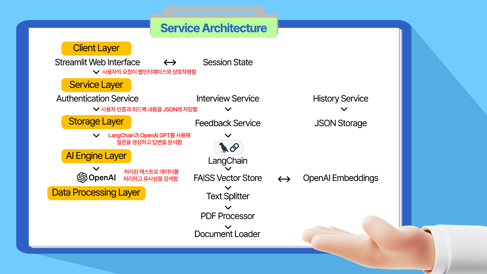
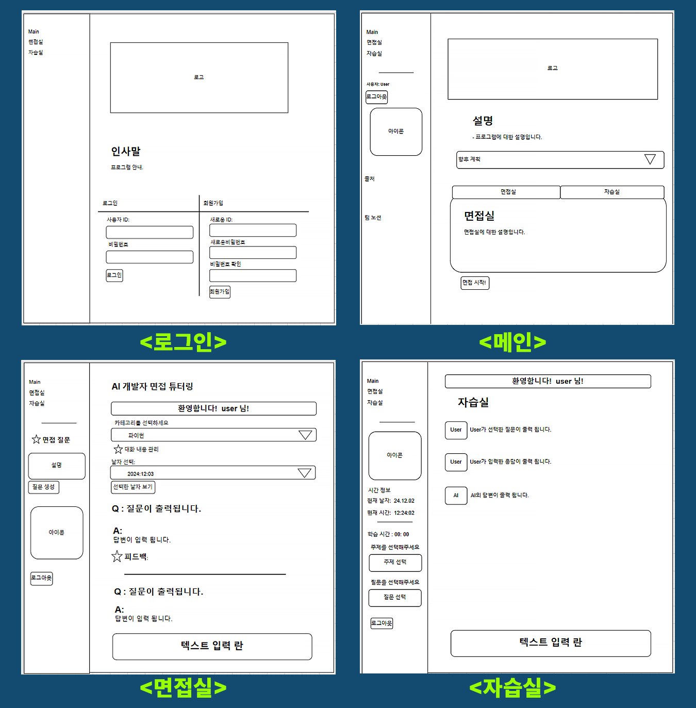

# READ.ME

## **1. 개요**

### **1.1 프로젝트 정보**

- **프로젝트명**: IT 개발자 면접 튜터링 서비스
    - 8가지 카테고리 중 사용자가 선택한 주제에 대한 면접 질문을 제공하고, 답변을 튜터링해주는 서비스입니다.
        - 카테고리: 파이썬, 머신러닝, 딥러닝, 데이터구조, 운영체제, 네트워크, 통계, 알고리즘
- **개발 기간**: 24.11.21.(목)~24.12.3(월), 13일 간
    
    
| 날짜               | 목표                                                                                         | 비고  |
|--------------------|----------------------------------------------------------------------------------------------|-------|
| 11/21(목)         | - 레포지토리 개설 및 초대<br>- 기획<br>- 역할분담, 이해도 점검 (GitHub, 모델 등)             | 1일   |
| 11/22(금)~23(토)  | - 데이터 수집 및 전처리                                                                      | 2일   |
| 11/24(일)~27(수)  | - 챗봇 훈련 및 모델 학습                                                                     | 4일   |
| 11/28(목)~12/2(월)| - Streamlit 인터페이스 디자인<br>- 챗봇 오류 개선<br>- 스트림릿 오류 개선<br>- 문서 작성       | 5일   |
| 12/3(화)          | - 최종 점검 및 회고<br>- 문서 작성                                                           | 1일   |


- **개발 인원**: 4명
    
| 이름(구분)        | 역할 및 기여도                                                                                                 |
|-------------------|--------------------------------------------------------------------------------------------------------------|
| **이다원(팀장)**  | - 기획: 아이디어 제안, 의견 취합 <br>- 자료수집 및 전처리: Python, MachineLearning<br>- 백엔드 개발: 카테고리 불러오기, 대화 내용 저장(날짜별), 학습시간 기록, 프롬프트 작성, 로그인 및 회원가입 기능 등<br> 문서작성: SA, README <br>- 기타: 로고 제작, 시스템 아키텍처 작성 등 |
| **장한검(서기)**  | - 기획: 아이디어 제안, 팀 노션 관리 <br> - 자료수집 및 전처리: Algorithm, Data Structure <br>- 프론트엔드 개발: <br> 1. 메인페이지 프로그램 소개 및 세션 구분 구현(FE 공통) <br>2. 페이지별 사용자 확인 <br> 3. 자습실 셀렉트 박스 대화창 연동 (주제 선택, 질문 선택 → 질문 출력)<br> 4. 자습실 챗봇과 대화 UI <br> - 문서 작성:<br>1. 다이어그램 작성 <br> 2. README 개선 사항 제안 |
| **김준기(팀원)**  | - 기획: 아이디어 제안 <br> - 자료수집 및 전처리: Deep Learning, Operating System   <br>- 백엔드 개발: 카테고리 불러오기, 대화 내용 불러오기, 프롬프트 작성, 자동 번역 기능 구현, 현재 시간 구현  <br>- 문서 작성: 다이어그램, SA, README  |
| **전상우(팀원)**  | - 기획: 아이디어 제안 <br> - 자료수집 및 전처리: Statistics, Network<br> - 프론트엔드 개발: <br> 1. 메인페이지 프로그램 소개 및 세션 구분 구현(공통) <br> 2. 멀티 페이지 기능 구현 <br> 3. 면접실 셀렉트 박스와 대화창 연동 (주제 선택, 새 질문 출력) <br> 4. 코드 최적화  <br> 5. 전체 페이지 구현 기능 오작동 여부 확인 <br> 6. Spinner 기능 구현  |


### **1.2 프로젝트 목적**

- AI 기반 IT 개발자 면접 튜터링 시스템 구축
- PDF 기반 질문 생성 및 답변 피드백 제공
- 사용자별 학습 이력 관리

### **1.3 기획 의도**

AI 기술의 급속한 발전으로 많은 직업이 변화하고 있으며, IT 개발자를 꿈꾸는 분들의 수가 증가하고 있습니다. 대형 언어 모델(LLM)과 Retrieval-Augmented Generation(RAG)과 같은 신기술은 무한한 가능성을 지니지만, 이에 대비한 준비가 필요합니다. 그러나 시간과 장소의 제약으로 오프라인 면접 튜터링에 참여하기 어려워 불편함을 겪고 계실 것입니다.

이 문제를 해결하기 위해 누구나 편리하게 온라인에서 면접 연습을 할 수 있는 서비스를 개발하였습니다. 이 서비스는 두려움 없이 면접을 준비하고, 전문가의 피드백과 맞춤형 연습 세션을 통해 자신감을 높일 수 있도록 도와드립니다. 저희 플랫폼은 실시간 피드백, 진행 상황 추적 등을 제공하여 여러분의 커리어 목표 달성에 기여하고자 합니다. IT 분야에 관심이 있고 개발자가 되기를 꿈꾸는 분들께 이 서비스를 추천드립니다.

## **2. 주요 기능**

전체적인 흐름을 보면, AI가 관여하는 모든 단계는 **질문하기**, **응답 처리**, **저장**으로 구성됩니다.

기본적으로 주요 기능은 두 가지 서비스를 제공합니다:

### 2.1 AI의 무작위 질문 제시 및 피드백 서비스

  


사용자는 로그인하여 사용자 정보를 받은 후 원하는 서비스를 선택합니다. 이 서비스에서는 AI가 IT 기업에서 자주 묻는 인터뷰 질문을 무작위로 제시하고, 사용자는 그에 대한 답변을 작성합니다. 답변의 정확성에 상관없이, AI는 사용자가 작성한 답변을 이해하고 부족한 부분을 찾아내어 그에 따른 피드백을 제공합니다. 이것이 이 서비스의 주요 기능이자 장점입니다.

### 2.2 사용자의 질문 선택 및 답변 서비스

  

사용자는 IT 기업에서 자주 묻는 인터뷰 질문에 대해 AI로부터 답변이나 정보를 얻을 수 있습니다. 질문 목록을 통해 원하는 질문을 선택하고, 해당 질문의 답변을 확인하며 학습할 수 있습니다. 이를 통해 자신의 지식을 테스트하고 보완할 수 있습니다. 

### **2.1 사용자 관리**

- 사용자 등록 및 로그인 처리
- 세션 관리
- 비밀번호 해싱 처리

```python
# 로그인/회원가입 처리
if not st.session_state["authenticated"]:
    tab1, tab2 = st.tabs(["로그인", "회원가입"])
    
    with tab1:
        login_id = st.text_input("사용자 ID:")
        login_pw = st.text_input("비밀번호:", type="password")
        if st.button("로그인"):
            # 사용자 인증 처리
            if verify_user(login_id, login_pw):
                st.session_state["authenticated"] = True
                st.session_state["user_id"] = login_id
```

### 2.2 학습 관리

- 주제별 질문 분류
- 날짜 및 시간 확인
- 총 학습 시간 계산

```python
# 세션 상태 초기화
if "user_start_times" not in st.session_state:
    st.session_state["user_start_times"] = {}

# 학습 시간 계산 및 표시
if st.session_state["user_id"]:
    user_id = st.session_state["user_id"]
    if user_id not in st.session_state["user_start_times"]:
        st.session_state["user_start_times"][user_id] = datetime.now()
    
    elapsed_time = datetime.now() - st.session_state["user_start_times"][user_id]
    hours, remainder = divmod(elapsed_time.seconds, 3600)
    minutes, seconds = divmod(remainder, 60)

    col5, col6 = st.sidebar.columns(2)
    col5.markdown('<p style="color:white; font-weight:bold;">학습 시간</p>', unsafe_allow_html=True)
    col6.markdown(f'<p style="color:white; font-weight:bold;">{hours:02d}:{minutes:02d}:{seconds:02d}</p>', unsafe_allow_html=True)
```

### **2.3 PDF 처리**

- PDF에서 질문 추출
- 중복 질문 방지
- 랜덤 질문 선택

```python
def extract_interview_questions(content):
    questions = []
    lines = content.split('\n')
    
    for line in lines:
        if (line.startswith('`') and line.endswith('`') and
            len(line) > 10):
            question = line.strip('`').strip()
            questions.append(question)
            
    # 중복 제거 및 이전 질문 필터링
    available_questions = [q for q in questions 
                         if q not in st.session_state["used_topics"]]
    
    return random.choice(available_questions)
```

### **2.4 컨텍스트 기반 피드백**

- 관련 문맥 추출
- AI 기반 피드백 생성
- 구조화된 피드백 제공

```python
def generate_feedback(question, answer, context):
    feedback_chain = feedback_prompt | ChatOpenAI(
        model="gpt-3.5-turbo-0125",
        temperature=0.2
    ) | StrOutputParser()
    
    feedback = feedback_chain.invoke({
        "context": context,
        "question": question,
        "answer": answer
    })
    
    return feedback
```

### **2.5 대화 이력 관리**

- 대화 저장
- 날짜별 관리
- 중복 제거

```python
def save_chat_history(user_id, messages):
    chat_dir = get_chat_directory()
    today = datetime.now().strftime("%Y-%m-%d")
    
    user_dir = chat_dir / user_id
    user_dir.mkdir(exist_ok=True)
    
    filepath = user_dir / f"{today}.json"
    
    try:
        # 기존 대화 내용 불러오기
        existing_data = []
        if filepath.exists():
            with open(filepath, 'r', encoding='utf-8') as f:
                existing_data = json.load(f)
        
        # 중복 제거 및 업데이트
        seen = set()
        unique_data = []
        for item in existing_data + messages:
            identifier = f"{item['question']}_{item.get('answer', '')}"
            if identifier not in seen:
                seen.add(identifier)
                unique_data.append(item)
        
        # 저장
        with open(filepath, 'w', encoding='utf-8') as f:
            json.dump(unique_data, f, ensure_ascii=False, indent=2)
            
    except Exception as e:
        st.error(f"대화 내용 저장 중 오류 발생: {str(e)}")
```

### **2.6 카테고리 관리**

- 주제별 분류
- 파일 구조 관리
- 카테고리별 질문 관리

```python
# 면접 주제 관리
CATEGORY_MAPPING = {
    "파이썬": "python",
    "머신러닝": "machine_learning",
    "딥러닝": "deep_learning",
    "데이터구조": "data_structure",
    "운영체제": "operating_system",
    "네트워크": "network",
    "통계": "statistics",
    "알고리즘": "algorithm"
}

# 디렉토리 구조 관리
directory_mapping = {
    "파이썬": "data/python/",
    "머신러닝": "data/machine_learning/",
    "딥러닝": "data/deep_learning/",
    # ...
}
```

## **3. 기술 스택**

### **3.1 프레임워크 및 라이브러리**

```python
- 언어: Python 3.10+
- 프레임워크: Streamlit
- AI/ML: OpenAI GPT, LangChain
- 데이터베이스: 로컬 JSON
```

- **Frontend/Backend**: Streamlit
- **AI/ML**:
    - OpenAI GPT API (ChatOpenAI, OpenAIEmbeddings)
    - LangChain (langchain_core, langchain_text_splitters, langchain_teddynote)
    - FAISS
- **데이터 처리**:
    - PyPDF2
    - PyPDFDirectoryLoader
    - RecursiveCharacterTextSplitter
- **저장소**:
    - JSON
    - 로컬 파일 시스템
- **유틸리티:**
    - dotenv
    - pathlib
    - datetime
    - os
- **협업도구:** GitHub, Slack, Notion





- **의사결정:**
<br>
- **Streamlit은** 웹 애플리케이션 프레임워크로 인터페이스를 구축하고, 사용자의 입력을 처리하며 데이터를 시각화하는데 매우 유용한 프로그램이라 생각되어 메인 프레임워크로 선택했습니다. 특히 파이썬을 기반으로 한  AI/ML과 잘 통합되고, 별도의 서버 없이 배포할 수 있어 선택하게 되었습니다. 
<br>
- **Open AI는** 자연어 처리능력이 좋고, 구조화된 피드백 생성에 특화되었습니다. 환경 변수에서 API를 로드할 수 있고, 모델을 선택하여 일관된 답변을 기대할 수 있었습니다. 특히 gpt-3.5-turbo-0125신규 모델은 gpt-3.5-turbo 모델에 비교해 질문당 약 50% 저렴한 가격에 사용할 수 있었습니다.
<br>
- **LangChain은** AI/LLM 통합 프레임워크로 프롬프트를 별도로 관리하고, 파이프라인을 직관적으로 구성하기 좋았습니다. 효율적으로 텍스트를 분할하여 구조화된 출력을 가능하게해 선택하게 되었습니다.
<br>
- **FAISS는** 벡터검색 프레임워크로 PDF에서 추출한 문서를 효율적으로 embedding해주고, 가장 관련성이 깊은 문서를 검색해주며 LangChaing과 원활히 통합되어 선택하게 되었습니다.
<br>
- **PyPDF2**는 PDF 처리 프레임워크로 페이지별로 데이터를 처리하여 메모리 관리에 효율적이고, streamlit 캐시 및 한국어를 효과적으로 처리해줘 선택하게 되었습니다. 또한 한 디렉터리에 있는 여러 PDF파일을 동시에 로드하여 구문 분석과 텍스트 추출에 강점이 있는 PyPDFDirectoryLoader 방식과 상호보완적으로 작용하는 강점이 있었습니다.
<br>

- **JSON파일을 로컬방식**으로 관리한 이유는 프로토타입의 개발과 테스트에 적합했기 때문입니다. 일주일 이라는 짧은 개발 시간이 주어졌기에 복잡한 데이터베이스를 설정하는 시간을 줄였고, 쉬운 백업과 디버깅으로 추가 비용까지 줄일 수 있었습니다. 테스트가 통과되면 DB를 통해 관리하고, 로그인 보안기능을 강화할 예정입니다.  
  


## **4. 배포 및 운영**

### **4.1 필요 환경**

- Python 3.10+
- OpenAI API 키
- 충분한 저장 공간 (PDF 파일용)

### **4.2 설치 및 실행**

```python
pip install -r requirements.txt
streamlit run 1_main.py
```

### **4.3 트러블 슈팅**

- **FE**
    - 데이터 전처리
    - 멀티 페이지 구현하기
    - 개발환경 일치시키기
    - 로그인 기능
    - api키 입력란
- **BE**
    - 데이터 전처리
    - Loader선정
    - Prompt작성
    - 사용자 정보 저장
    - 시간 정보 구현

- 자세한 내용은 [팀노션](https://www.notion.so/teamsparta/b56a4b7a92be4401984a51bc59004046) 을 확인해주세요.

## **5. 확장성 및 유지보수**

### **5.1 확장 가능한 부분**

- 문제 풀이 개수 및 등수 확인
- 실시간 채팅 기능 추가
- 다국어 지원
- 새로운 면접 카테고리 추가
- 책갈피 기능 추가
- agent를 통한 웹 검색 기능 추가

### **5.2 유지보수 고려사항**

- PDF 파일 정기 업데이트
- 모니터링(응답 시간, API호출 횟수, 오류발생 빈도 등)
- 사용자 피드백 수집
- 시스템 성능 최적화(PDF 캐싱, 벡터 검색 최적화, Streamlit 캐시 활용 등)
- 보안강화(세션 타임아웃 구현, 입력값 검증 강화, 로그인 시도 제한 등)

## **6. 향후 개선 계획**

### **6.1 단기 목표**

- UI/UX 개선
- 에러 처리 강화
- 사용자 피드백 시스템 구현

### **6.2 장기 목표**

- AI 모델 고도화
- 실시간 협업 기능
- 모바일 최적화
